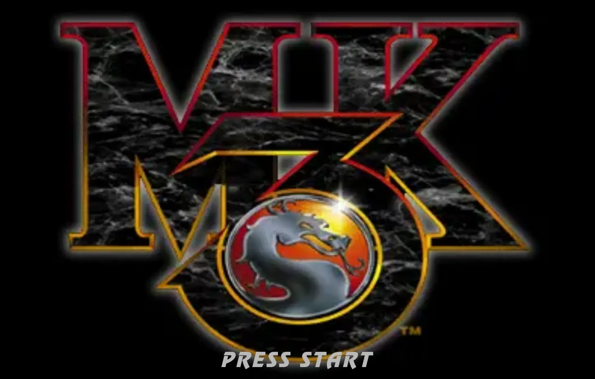
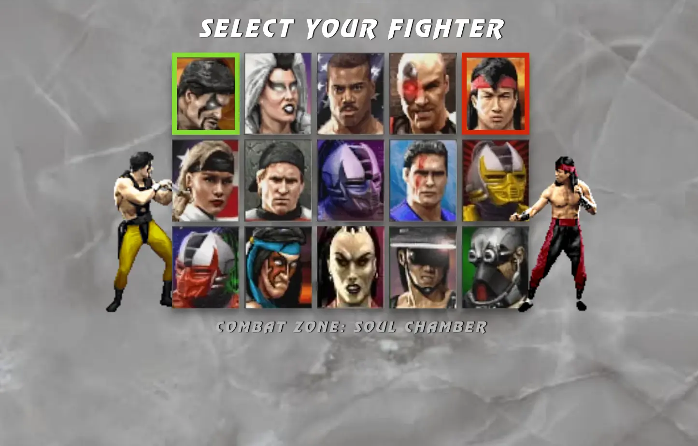
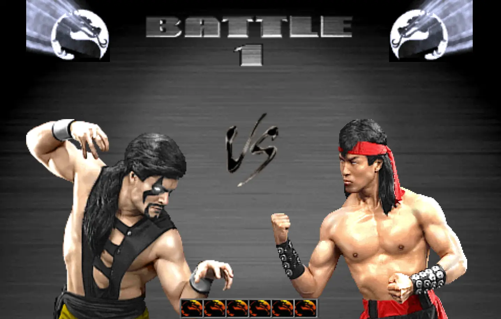

<h1 align="center">MK Test App</h1>

Даний додаток - це тестове завдання, яке імітує три екрани з популярної комп'ютерної гри <b>Mortal Kombat 3</b>.

 У завданні використовувалися такі технологіЇ:
- React.js,
- Redux-Toolkit.js,
- React Router.

Всі зображення були оптимізовані за допомогою Squoosh https://squoosh.app/ 
 

<h3 align="center">MainPage</h3>

Це стартова сторінка, яка дозволяє по кліку лівою кнопкою миші на "PRESS START" або безпосередньо при натисканні клавіши "ENTER" перейти на наступну сторінку з вибором персонажів для початку гри.

<h3 align="center">SelectCharacterPage</h3>

Це сторінка з вибором персонажів для гри за допомогою клавіш ArrowUp / ArrowDown / ArrowLeft / ArrowRight.

 Після вибору персонажу першим гравцем після натискання клавіши "ENTER" стає доступним вибір персонажу другим гравцем.

Після вибору персонажу другим гравцем після натискання клавіши "ENTER" через 2 секунди додаток переходить на наступну сторінку.

<h3 align="center">VersusCodePage</h3>

Це остання сторінка даного додатку.  На ній відображаються ті перонажі, які були обрані на попередній сторінці. Також за допомогою клавіш "Q", "W", "E", "R", "T", "Y" можна обернути обмежений список символів, по одному на кожну клавішу, після чого через 4 секунди додаток повертається на стартову сторінку.

**Використання прикладу:**
 1. Встановити всі залежності за допомогою команди npm install .
 2. Запустити додаток за допомогою команди npm start .
Додаток буде доступний у браузері за адресою http://localhost:3000.